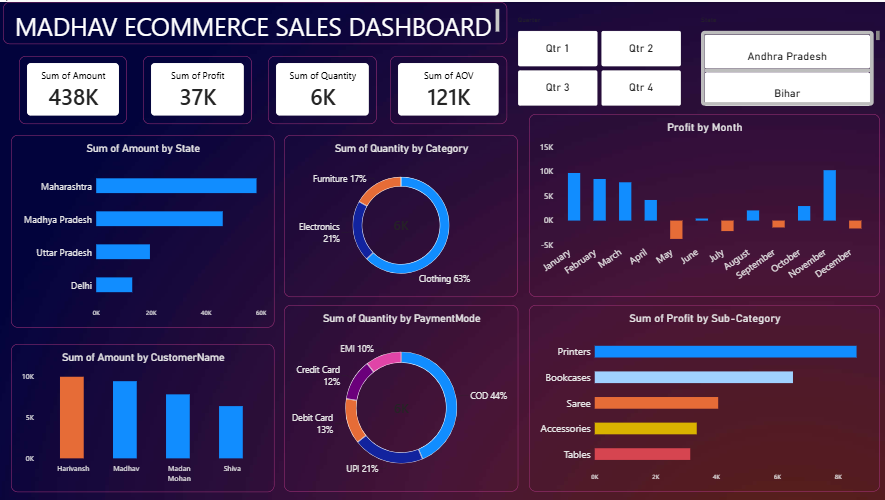

# Madhav-Store-Sales-Analysis-PowerBI
Interactive Power BI dashboard for analyzing Madhav Store sales, profit, customers, categories, payment modes, and regional performance.

## Project Overview
Madhav Store Sales Analysis is an interactive sales dashboard created using Microsoft Power BI.
The project focuses on analyzing sales data and presenting meaningful business insights through interactive charts, graphs, and filters.

## Tools & Technologies
- Microsoft Power BI
- Power Query
- Data Cleaning & Transformation
- Data Visualization
- CSV Dataset

## Project Files
- `Sales Performance Dashboard.pbix` – Power BI dashboard file
- `Dashboard_Image.png` – Dashboard preview
- `Orders.csv` – Orders dataset
- `Details.csv` – Sales details dataset

## Key Insights
- Overall sales performance
- Sales by category
- Sales by state
- Monthly sales trends
- Customer analysis
- Payment mode analysis
- Order analysis

## Key Features
- Interactive dashboard
- Data cleaning and transformation
- Multiple charts and visualizations
- Interactive slicers and filters
- Easy-to-understand sales insights

## Dashboard Preview

## 🎓 Project Purpose

The main objective of this project is to analyze store sales data using Power BI and transform raw data into meaningful visual insights that can support business decision-making.

## 👨‍💻 Skills Demonstrated

- Power BI
- Power Query
- Data Analysis
- Data Cleaning
- Data Visualization
- Business Intelligence
